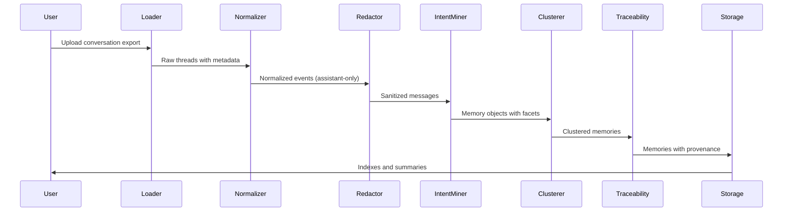

# Codessa-Seed Ingestion Workflow

## Overview

The Codessa-Seed ingestion pipeline transforms exported conversation archives into persistent, queryable memory objects with semantic understanding and intent extraction. This MVP focuses on ChatGPT/Claude exports with emphasis on capturing the **WHY** behind conversations.

## System Architecture



## Data Contracts and Schemas

### Input Formats
- **ChatGPT JSON**: Native export format with conversation mapping
- **Claude Markdown**: Text-based export with conversation structure
- **Custom JSON**: Normalized conversation format

### Processing Pipeline Output
- **Memory Objects**: Intent-enriched conversation fragments
- **Thread Index**: Per-conversation metadata and outcomes
- **Cluster Index**: Semantic groupings with insights
- **Provenance Chain**: Complete source-to-memory traceability

## LLM Prompting Strategy for Intent Extraction

### Stage A: Heuristic Pre-Pass
The system first scans for explicit intent indicators:
- "The key insight is..."
- "The risk here is..."
- "Here's how you could..."
- "The purpose of this approach..."
- "What we're trying to achieve..."

### Stage B: LLM Analysis
**System Prompt:**
```
You are a conversation analyst that extracts the underlying intent and purpose from assistant-authored responses. Your job is to identify WHY the assistant provided this response - not just what was said, but the deeper motivation, principles, and intended outcomes.

Analyze the provided assistant message and extract the following facets in valid JSON format:

{
  "why": "The core reason or purpose behind this response",
  "core_principles": ["fundamental principles or beliefs expressed"],
  "capabilities": ["abilities or skills demonstrated or discussed"],
  "constraints": ["limitations, boundaries, or restrictions mentioned"],
  "risks": ["potential risks, concerns, or warnings identified"],
  "opportunities": ["possibilities, potential benefits, or next steps suggested"],
  "unresolved_loops": ["incomplete thoughts, open questions, or matters requiring follow-up"],
  "integration_points": ["connections to other systems, concepts, or future work"]
}

Rules:
- Extract only what is explicitly present or clearly implied
- Use concise, specific language
- Empty arrays for missing categories
- Focus on intent over surface content
- No speculation beyond reasonable inference
```

**User Prompt Template:**
```
Context: This is an assistant message from a conversation titled "{thread_title}".

Message: {sanitized_message_content}

Extract the intent facets as specified in your system prompt.
```

**LLM Configuration:**
- Temperature: 0.1 (high consistency)
- Max tokens: 1000
- Retry limit: 3 with exponential backoff
- Rate limiting: 10 requests/second with burst capacity

## Error Handling and Logging

### Error Categories
1. **Parse Errors**: Malformed input files, unsupported formats
2. **Processing Errors**: LLM failures, network timeouts, rate limits
3. **Storage Errors**: Write failures, schema violations, connection issues
4. **Validation Errors**: Schema mismatches, missing required fields

### Logging Strategy
- **Structured JSON logs** with consistent field names
- **Per-file error logs**: `logs/errors-YYYYMMDD.log`
- **Metrics logs**: ingestion statistics and performance data
- **Debug logs**: detailed processing steps for troubleshooting

### Quality Assurance Plan
1. **Schema Validation**: All memory objects validated against JSON schema
2. **Content Integrity**: Hash verification for source traceability
3. **Idempotence Testing**: Re-processing produces identical results
4. **Performance Monitoring**: Track processing times and throughput

## Runbook

### Local Development
```bash
# Basic ingestion without LLM
python tools/seed_ingest.py \
  --input ./tools/examples/sample_export.json \
  --output ./memory/out.jsonl \
  --use-llm false

# Full pipeline with intent mining
python tools/seed_ingest.py \
  --input ./tools/examples/sample_export.json \
  --output ./memory/out.jsonl \
  --use-llm true \
  --model gemini-1.5-pro \
  --config ./tools/sample_config.yaml

# Batch processing multiple files
python tools/seed_ingest.py \
  --input ./exports/ \
  --output ./memory/ \
  --batch-size 50 \
  --use-llm true
```

### GCP Deployment Options

#### Option 1: Cloud Run Job
```bash
# Build container
gcloud builds submit --tag gcr.io/PROJECT_ID/codessa-seed-ingest

# Deploy as job
gcloud run jobs create codessa-seed-ingest \
  --image gcr.io/PROJECT_ID/codessa-seed-ingest \
  --region us-central1 \
  --memory 2Gi \
  --cpu 1 \
  --max-retries 3 \
  --parallelism 1

# Execute job
gcloud run jobs execute codessa-seed-ingest \
  --region us-central1 \
  --args="--input,gs://bucket/exports/,--output,gs://bucket/memory/,--use-llm,true"
```

#### Option 2: Cloud Function
```bash
# Deploy function
gcloud functions deploy codessa-seed-ingest \
  --gen2 \
  --runtime python39 \
  --trigger-http \
  --entry-point main \
  --memory 1Gi \
  --timeout 540s \
  --max-instances 10
```

### Firestore Security Rules
```javascript
rules_version = '2';
service cloud.firestore {
  match /databases/{database}/documents {
    // Memory objects - read/write for authenticated users
    match /codessa_seed_memory_objects/{document} {
      allow read, write: if request.auth != null;
    }
    
    // Thread indexes - read for authenticated, write for service account
    match /codessa_seed_threads/{document} {
      allow read: if request.auth != null;
      allow write: if request.auth.token.email.matches('.*@PROJECT_ID.iam.gserviceaccount.com');
    }
    
    // Cluster indexes - read for authenticated, write for service account  
    match /codessa_seed_clusters/{document} {
      allow read: if request.auth != null;
      allow write: if request.auth.token.email.matches('.*@PROJECT_ID.iam.gserviceaccount.com');
    }
  }
}
```

## Performance Constraints (MVP)

### Processing Targets
- **10k messages in <10 minutes** locally without LLM
- **With LLM**: Batch processing with caching, estimated 30-60 seconds per message
- **Memory retrieval**: <200ms for 10k records from local JSONL
- **Clustering**: Handle up to 1000 memory objects per cluster operation

### Optimization Strategies
- **LLM Caching**: Cache intent extraction results by message hash
- **Batch Processing**: Process messages in configurable batch sizes
- **Parallel Processing**: Multi-thread where possible (I/O bound operations)
- **Incremental Clustering**: Only re-cluster when similarity thresholds change

## Acceptance Criteria

### Functional Requirements
- [ ] End-to-end processing of sample_export.json produces ≥10 memory objects
- [ ] Memory objects conform to schema with zero validation errors
- [ ] Thread index generated with accurate statistics
- [ ] Cluster index created with semantic groupings
- [ ] All memory objects have complete provenance chains
- [ ] Re-processing same input produces identical results (idempotent)

### Quality Requirements
- [ ] Structured logs include ingestion metrics
- [ ] Intent extraction accuracy >85% on validation dataset
- [ ] Processing completes within performance constraints
- [ ] Error handling gracefully manages malformed inputs
- [ ] Storage operations are atomic and consistent

### Integration Requirements
- [ ] Output format compatible with Codessa-Core protocols
- [ ] API endpoints respond within latency requirements
- [ ] Firestore adapter properly batches operations
- [ ] Local JSONL storage supports concurrent access

## Verification Checklist

### Pre-Processing
- [ ] Input file format detected correctly
- [ ] Source hash computed and stored
- [ ] Required directories created
- [ ] Configuration loaded and validated

### Processing Pipeline
- [ ] Messages normalized to standard format
- [ ] Assistant messages filtered correctly
- [ ] PII redaction applied where configured
- [ ] Intent extraction completed successfully
- [ ] Semantic clustering produces coherent groups

### Post-Processing
- [ ] Memory objects pass schema validation
- [ ] Indexes generated with complete data
- [ ] Provenance chains verified
- [ ] Storage operations committed successfully
- [ ] Output files readable and well-formed

## Alignment to Vision

This ingestion pipeline directly implements Codessa-Seed's core mission by:

1. **Intent Over Content**: The two-stage intent mining process specifically extracts the **WHY** behind conversations, not just the surface content
2. **Memory With Meaning**: Every memory object carries semantic context through clustering and facet extraction
3. **Symbiotic Evolution**: The system learns from conversation patterns to identify recurring themes and unresolved loops
4. **Traceability Always**: Complete provenance chains ensure every insight traces back to its conversational source

The pipeline transforms static conversation exports into living memory that preserves the collective wisdom embedded in human-AI collaboration, enabling the broader Codessa ecosystem to access contextual knowledge that transcends individual chat sessions.