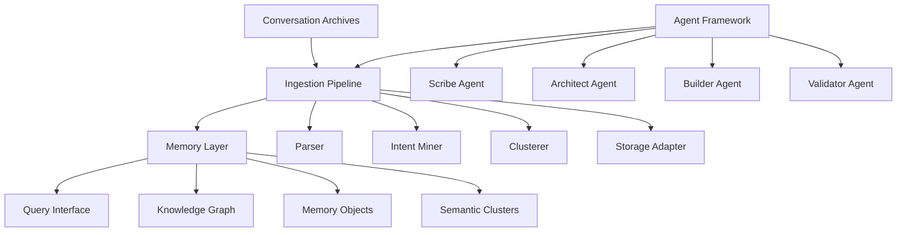

# 🌌 Codessa-Seed

**The Memory Kernel of the Codessa Ecosystem**

Codessa-Seed transforms conversation history into persistent, intent-aware knowledge that fuels autonomous agent cognition. More than just content extraction, it interprets the *why* behind discussions—the purposes, principles, opportunities, and unresolved loops that drive human-AI collaboration.

[](https://www.python.org/downloads/)
[](https://opensource.org/licenses/MIT)
[]()
[]()

## 🎯 Vision

Codessa-Seed reincarnates the collective wisdom embedded in conversation history into a living, persistent memory system that transcends ephemeral chat sessions. It enables:

- **Intent Preservation**: Captures not just *what* was said, but *why* it was said
- **Memory Continuity**: Builds persistent knowledge across conversation boundaries  
- **Pattern Recognition**: Identifies recurring themes, contradictions, and opportunities
- **Context Awareness**: Provides agents with rich historical context for decision-making
- **Symbiotic Evolution**: Enables human insight and AI capability to co-evolve over time

## 🚀 Quick Start

### Prerequisites

- Python 3.9+
- Google Cloud SDK (optional, for Firestore)
- 8GB+ RAM recommended for large conversation archives

### Installation

```bash
git clone https://github.com/your-org/codessa-seed.git
cd codessa-seed

# Create virtual environment
python -m venv venv
source venv/bin/activate  # On Windows: venv\Scripts\activate

# Install dependencies
pip install -r requirements.txt

# Install development dependencies (optional)
pip install -r requirements-dev.txt
```

### Basic Usage

```bash
# Process a ChatGPT conversation export
python tools/seed_ingest.py \
  --input ./examples/chatgpt_export.json \
  --output ./memory/processed/ \
  --use-llm false

# With LLM intent extraction (requires API key)
python tools/seed_ingest.py \
  --input ./examples/chatgpt_export.json \
  --output ./memory/processed/ \
  --use-llm true \
  --model gemini-1.5-pro

# Query the memory base
python -c "
from memory.knowledge_graph import KnowledgeGraph
from src.ingestion.storage_adapter import JSONLStorage

kg = KnowledgeGraph(JSONLStorage('./memory/processed/'))
results = kg.query_memories('system architecture', limit=5)
print(f'Found {len(results)} relevant memories')
"
```

## 🏗️ Architecture

### Core Components



### Data Flow

1. **Archive Ingestion**: Multi-format conversation parsing (ChatGPT JSON, Claude Markdown, custom)
2. **Event Normalization**: Unified message structure with metadata extraction
3. **Intent Mining**: Two-stage analysis (heuristic + LLM) to extract purpose and principles
4. **Semantic Clustering**: Group related conversations by topic and intent patterns
5. **Memory Persistence**: Store with full traceability in JSONL or Firestore
6. **Context Retrieval**: Semantic search and pattern matching for agent consumption

### Memory Object Structure

```json
{
  "id": "uuid",
  "thread_id": "conversation_identifier",
  "text": "original_message_content",
  "facets": {
    "why": "extracted_intent_and_purpose",
    "core_principles": ["identified_principles"],
    "opportunities": ["potential_actions"],
    "constraints": ["limitations_identified"],
    "risks": ["concerns_raised"],
    "unresolved_loops": ["incomplete_thoughts"]
  },
  "cluster_id": "semantic_group_identifier",
  "provenance": {
    "source_file": "original_export.json",
    "hash": "cryptographic_integrity_hash"
  }
}
```

## 📚 Documentation

### Essential Reading
- [Vision Constitution](docs/VISION_CONSTITUTION.md) - North Star principles and mission
- [Project Manifest](docs/PROJECT_MANIFEST.md) - Scope, objectives, and success criteria
- [Architecture Guide](docs/ARCHITECTURE.md) - System design and component interactions
- [API Specification](docs/API_SPECIFICATION.md) - Interface contracts and schemas

### Developer Guides
- [Ingestion Workflow](docs/INGESTION_WORKFLOW.md) - Pipeline implementation details
- [Agent Roles](docs/AGENT_ROLES.md) - Specialized agent responsibilities
- [Development Workflows](docs/DEVELOPMENT_WORKFLOWS.md) - Build, test, and deployment

### Quick Reference
- [Requirements Matrix](docs/REQUIREMENTS_MATRIX.md) - Functional and non-functional requirements
- [Schema Reference](memory/schema.json) - Complete data schemas

## 🔧 Development

### Project Structure

```
codessa-seed/
├── src/
│   ├── ingestion/          # Conversation processing pipeline
│   │   ├── parser.py       # Multi-format archive parsing
│   │   ├── intent_miner.py # LLM-based intent extraction
│   │   ├── clusterer.py    # Semantic grouping
│   │   └── storage_adapter.py # Persistence layer
│   └── agents/             # Specialized processing agents
├── memory/                 # Persistent knowledge storage
│   ├── schema.json        # Data structure definitions
│   └── knowledge_graph.py # Semantic relationship manager
├── tests/                 # Comprehensive test suite
├── tools/                 # CLI utilities and examples
└── docs/                  # Complete documentation
```

### Running Tests

```bash
# Full test suite
pytest tests/ -v --cov=src --cov-report=html

# Component-specific tests
pytest tests/test_ingestion.py -v
pytest tests/test_memory.py -v
pytest tests/test_agents.py -v

# Performance benchmarks
pytest tests/performance/ --benchmark-only

# Property-based tests
pytest tests/property/ --hypothesis-seed=42
```

### Code Quality

```bash
# Format code
black src/ tests/ tools/

# Type checking
mypy src/

# Linting
flake8 src/ tests/

# Security scan
bandit -r src/
```

## 📊 Performance Targets

- **Ingestion**: 10,000 messages processed in <10 minutes
- **Query Response**: <200ms for semantic search over 10k records
- **Storage Efficiency**: <1MB per 1000 memory objects
- **Accuracy**: >85% intent classification on validation datasets

## 🔐 Security & Privacy

- **PII Redaction**: Configurable patterns for sensitive data masking
- **Encrypted Storage**: AES-256 encryption for persistent data
- **Access Control**: Role-based permissions for memory access
- **Audit Logging**: Complete operation tracking for compliance

## 🚀 Deployment

### Local Development
```bash
# Start with local JSONL storage
python tools/seed_ingest.py --storage jsonl --base-path ./memory/

# Query local memories
python tools/query_memories.py --storage jsonl --query "architecture patterns"
```

### Cloud Deployment (Google Cloud)
```bash
# Deploy as Cloud Run service
gcloud run deploy codessa-seed \
  --source . \
  --region us-central1 \
  --allow-unauthenticated

# Process archives via Cloud Functions
gcloud functions deploy process-archive \
  --runtime python39 \
  --trigger-http \
  --entry-point ingest_handler
```

### Docker
```bash
# Build container
docker build -t codessa-seed .

# Run ingestion
docker run -v $(pwd)/data:/data codessa-seed \
  python tools/seed_ingest.py --input /data/export.json
```

## 🤝 Contributing

We welcome contributions! Please see our [Contributing Guide](CONTRIBUTING.md) for details.

### Development Setup
1. Fork the repository
2. Create a feature branch: `git checkout -b feature/amazing-feature`
3. Install development dependencies: `pip install -r requirements-dev.txt`
4. Run tests: `pytest tests/ -v`
5. Submit a pull request

### Code Standards
- Python 3.9+ with type hints
- Black formatting (line length 100)
- Pytest for testing (>90% coverage)
- Conventional commit messages
- Documentation for all public APIs

## 📈 Roadmap

### Phase 1: Foundation (MVP)
- [x] Project scaffolding and documentation
- [ ] Multi-format conversation parsing
- [ ] Intent mining with LLM integration
- [ ] Local JSONL storage adapter
- [ ] Basic semantic clustering

### Phase 2: Intelligence 
- [ ] Advanced intent extraction patterns
- [ ] Firestore cloud storage
- [ ] RESTful query API
- [ ] Agent framework implementation
- [ ] Performance optimization

### Phase 3: Integration
- [ ] Codessa-Core integration
- [ ] Real-time processing capabilities
- [ ] Advanced analytics dashboard
- [ ] Multi-tenant support
- [ ] Enterprise security features

## 📊 Metrics & Monitoring

- **Ingestion Metrics**: Messages processed, errors, processing time
- **Memory Metrics**: Storage utilization, query performance, accuracy scores
- **Agent Metrics**: Task completion rates, quality scores, autonomy levels
- **System Health**: Uptime, resource usage, error rates

## 🆘 Support

- **Documentation**: Comprehensive guides in `/docs`
- **Issues**: GitHub Issues for bugs and feature requests
- **Discussions**: GitHub Discussions for questions and ideas
- **Wiki**: Community-maintained knowledge base

## 📄 License

This project is licensed under the MIT License - see the [LICENSE](LICENSE) file for details.

## 🙏 Acknowledgments

- The Codessa ecosystem team for vision and architectural guidance
- The open-source community for foundational tools and libraries
- Contributors who help transform conversations into lasting wisdom

---

**Codessa-Seed**: *Where conversations become eternal memory* 🌌

*Transforming the whispers of dialogue into the persistent wisdom that guides autonomous intelligence.*